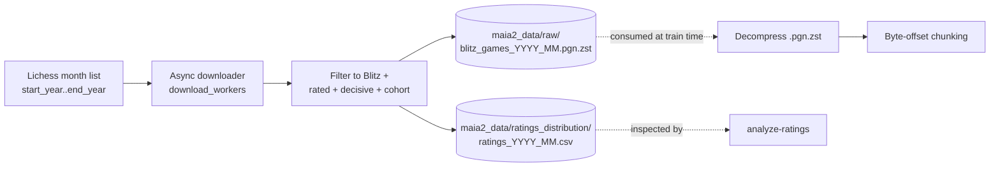
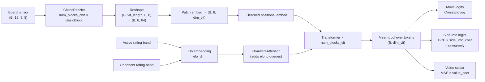
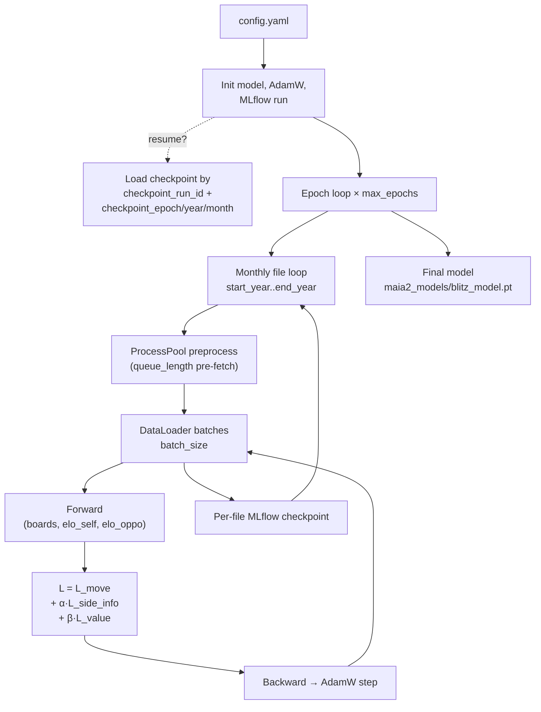

# little_maia2

A lightweight, single-model chess move-prediction system targeting **lower-rated Lichess players** (training cohort: ratings 400–1200, Blitz only). Fork of [CSSLab/maia2](https://github.com/CSSLab/maia2).

The model takes a board position and the two players' ratings, and returns a probability distribution over legal moves — calibrated so that the most likely move reflects what a human at that rating is actually likely to play, not the engine-optimal move. A single network handles every rating band; player skill is injected via small learned embeddings added to the transformer's attention queries.

> **Why this fork?** Upstream Maia-2 covers the full rating spectrum. `little_maia2` narrows the training cohort to weaker players (≤1200), where the human-style data is densest and the model is most useful for teaching/analysis tools targeted at improving players. Other deliberate departures from the paper (Blitz-only, draws dropped from the value head) are listed in [`CONTEXT.md`](CONTEXT.md#deliberate-divergences-from-the-maia-2-paper).

## Headline design

- **Two-tower architecture.** A ResNet encodes the 18-channel board tensor; a small ViT then attends over the CNN's feature channels.
- **Skill-aware attention.** Rating-band embeddings for the active player and opponent are concatenated and *added to the attention queries* inside every ViT block — not concatenated at the input, not appended at the head. This is the mechanism by which one network behaves like many.
- **Three heads, one model.** Move logits (cross-entropy), auxiliary side-info logits (BCE, training-only — moving piece type, capture, check, etc.), and a value scalar (MSE against active-player win ∈ {+1, −1}; draws excluded).

Full glossary in [`CONTEXT.md`](CONTEXT.md). Implementation detail in [`docs/architecture-notes.md`](docs/architecture-notes.md).

---

## Quickstart

Uses [uv](https://github.com/astral-sh/uv) for environment management.

```bash
# 1. install uv (one-time, skip if already installed)
curl -LsSf https://astral.sh/uv/install.sh | sh        # macOS / Linux
# powershell -c "irm https://astral.sh/uv/install.ps1 | iex"   # Windows

# 2. clone + install deps (creates .venv automatically, pins Python from pyproject.toml)
git clone https://github.com/DeyonOba/little_maia2.git
cd little_maia2
uv sync

# 3. run any command without activating the venv
uv run python main.py --help
```

Add / remove packages: `uv add <pkg>` / `uv remove <pkg>`. Lockfile lives in `uv.lock`.

---

## Commands

All commands go through `main.py`. The `--run-test` flag (placed before the subcommand) routes everything to `test_data/` instead of `maia2_data/`.

| Command | What it does |
|---|---|
| `python main.py download` | Async-download monthly Lichess Blitz PGNs into `maia2_data/raw/` (also emits `ratings_*.csv` for the analyzer). |
| `python main.py train` | Train the model. Errors out early if any expected raw `.zst` is missing — run `download` first. |
| `python main.py analyze-ratings [--percentile P] [--chunk-size N]` | Sample one chunk per monthly `ratings_*.csv`, count games per elo-pair, recommend a value for `max_games_per_elo_range`. See [Tuning `max_games_per_elo_range`](#tuning-max_games_per_elo_range) below. |
| `python main.py ui [--port P]` | Launch the MLflow tracking UI against `cfg.tracking_uri`. |

---

## Pipeline overview

### Data ingestion



Lives in `maia2/data_ingestion.py`. The `ratings_*.csv` sidecars (just `WhiteElo,BlackElo` per game) exist so you can estimate per-elo-pair game density without re-parsing the PGNs — that's what `analyze-ratings` consumes.

### Model architecture



The non-obvious bit: ViT tokens correspond to *CNN feature channels*, not board squares. See `docs/architecture-notes.md` for the channel decomposition and the dimensional contract between `elo_dim` and `dim_vit`.

### Training



Loop lives in `maia2/train.py`. Loss weights `α = side_info_coefficient`, `β = value_coefficient`. There is currently **no validation split** — the training loop optimises against training loss only; an eval harness is on the [AI-readiness backlog](docs/agents/ai-readiness-backlog.md).

---

## Configuration

All knobs live in [`maia2_models/config.yaml`](maia2_models/config.yaml). The keys you are most likely to change:

### Training cohort and date range

| Key | Default | Why you'd change it |
|---|---|---|
| `elo_lower_bound`, `elo_upper_bound` | `400`, `1200` | Bounds of the **training cohort** — both players' ratings must fall in `[lower, upper]`. Widen to train on more skilled play; narrow to focus tighter. Bands (`<600`, `600-699`, …, `>=1100`) are *separate* and don't need to move with the cohort. |
| `start_year`, `start_month`, `end_year`, `end_month` | `2013-05` → `2026-04` | Months of Lichess data to download / train on. Skipping `2019-12` is hard-coded (upstream data gap). |

### Data balancing — `max_games_per_elo_range`

A per-(elo-pair) per-chunk cap that downsamples popular pairings (e.g. `>=1100 / >=1100`) so the long tail of rare pairings is not drowned out. **Don't guess this value** — run the analyzer:

```bash
python main.py analyze-ratings --percentile 25
# → "Recommended max_games_per_elo_range: <N>
#    (median of per-month 25th-percentile across elo pairs)"
```

Lower percentile → more aggressive balancing. The script never writes back to `config.yaml`; copy the recommended integer in manually.

### Training schedule

| Key | Default | Notes |
|---|---|---|
| `max_epochs` | `3` | Passes over the full monthly file range. |
| `batch_size` | `8192` | Optimised for a single GPU; drop if you OOM. |
| `lr`, `wd` | `1e-4`, `1e-5` | AdamW. |
| `chunk_size` | `20000` | Games per PGN chunk; also the sample size used by `analyze-ratings`. |
| `num_cpu_left`, `num_workers`, `queue_length` | `16`, `16`, `2` | Parallel preprocessing. `num_cpu_left` is the ProcessPool size; `queue_length` is how many chunks are pre-fetched. |

### Model architecture

These are dimensional contracts — changing one forces matching changes elsewhere (see [`docs/architecture-notes.md`](docs/architecture-notes.md)).

| Key | Default | Role |
|---|---|---|
| `input_channels` | `18` | Must match `board_to_tensor`. |
| `dim_cnn`, `num_blocks_cnn` | `256`, `5` | ChessResNet width and depth. |
| `vit_length` | `8` | Token count emitted by the CNN→ViT bridge. |
| `dim_vit`, `num_blocks_vit` | `1024`, `2` | ViT token dim and depth. |
| `elo_dim` | `128` | Per-player rating-band embedding dim; `2 × elo_dim` is the size added to attention queries. |

### Loss heads

| Key | Default | Effect |
|---|---|---|
| `side_info`, `side_info_coefficient` | `true`, `1.0` | Toggle / weight the auxiliary side-info loss (training-only). |
| `value`, `value_coefficient` | `true`, `1.0` | Toggle / weight the value head. |

### MLflow + resumption

| Key | Default | Notes |
|---|---|---|
| `tracking_enabled` | `true` | Flip off for quick local debugging. |
| `tracking_uri` | `./mlruns` | File backend; pointed at by `python main.py ui`. |
| `experiment_name`, `registered_model_name` | `maia2_blitz`, `MAIA2Blitz` | MLflow experiment / registry slot. |
| `from_checkpoint` | `false` | Set `true` plus the four `checkpoint_*` keys to resume. |
| `checkpoint_run_id`, `checkpoint_epoch`, `checkpoint_year`, `checkpoint_month` | — | The MLflow run + position in the monthly loop to resume from. |

### Download politeness

`download_workers`, `max_concurrent_requests`, `request_timeout_seconds`, `download_max_retries`, `download_max_throttle_retries`, `month_failure_backoff_seconds` — leave these alone unless Lichess starts throttling you.

---

## Contributing

The README is a hub; canonical docs live alongside the code.

- **Domain vocabulary** (Player / Rating / Active perspective / Rating band / Skill-aware attention …): [`CONTEXT.md`](CONTEXT.md). Start here before writing prose or commit messages.
- **Implementation walkthrough** (18-channel encoding, two-tower architecture, paper-eval metrics): [`docs/architecture-notes.md`](docs/architecture-notes.md).
- **Issue workflow**: [`docs/agents/issue-tracker.md`](docs/agents/issue-tracker.md), with triage labels in [`docs/agents/triage-labels.md`](docs/agents/triage-labels.md). Issues live on GitHub at `DeyonOba/little_maia2`, operated via the `gh` CLI.
- **Infrastructure roadmap** (pytest, ruff, pre-commit, GH Actions CI, type checking, eval/smoke-train harness): [`docs/agents/ai-readiness-backlog.md`](docs/agents/ai-readiness-backlog.md). These are the gates that broaden the `ready-for-agent` label's scope.
- **Open clarifications**: [`docs/agents/open-questions.md`](docs/agents/open-questions.md).
- **Inference performance work** (cheap wins, `torch.compile`, INT8 quant, ONNX, request batching): [`maia2/docs/inference_optimization.md`](maia2/docs/inference_optimization.md).

---

## Further research

Open directions, roughly ordered by readiness:

- **Eval / smoke-train harness.** Currently the project has no held-out validation set and no top-1 / perplexity / monotonic-coherence reporting (the three metrics the Maia-2 paper uses). This is the highest-leverage gap — see backlog item 6.
- **Time-control coverage.** `from_pretrained("rapid", …)` raises `NotImplementedError`. Broadening to Rapid (and possibly Bullet) requires coordinated changes in `game_filter`, `from_pretrained`, and the data file-naming convention — see `CONTEXT.md::Time control`.
- **Draw modelling.** The fork drops drawn games entirely and uses MSE on `{+1, −1}` for the value head; the paper uses the ternary `{+1, 0, −1}` target. Either re-document the rationale or revert to the paper's design.
- **Cohort expansion.** Cohort is currently `[400, 1200]`. The rating-band scheme already supports values up to and beyond `>=1100`, so the model can serve higher-rated inference even without retraining — but a quantitative study of cross-cohort transfer would be informative.
- **Inference productionisation.** The plan in [`maia2/docs/inference_optimization.md`](maia2/docs/inference_optimization.md) (load-once, `torch.inference_mode`, `torch.compile`, INT8 dynamic quant, ONNX, request batching) is sketched but not yet realised in code.
- **Clock-time filter.** `clock_threshold: 30` is configured but the corresponding filter in `process_per_game` is commented out — see `CONTEXT.md::Flagged ambiguities`. Re-enabling it (along with the `extract_clock_time` plumbing) is a small but meaningful data-quality change.

---

## Reference

- **Upstream code**: <https://github.com/CSSLab/maia2>
- **Paper**: [Maia-2: A Unified Model for Human-AI Alignment in Chess (NeurIPS 2024)](https://arxiv.org/pdf/2409.20553)

```bibtex
@inproceedings{
tang2024maia,
title={Maia-2: A Unified Model for Human-{AI} Alignment in Chess},
author={Zhenwei Tang and Difan Jiao and Reid McIlroy-Young and Jon Kleinberg and Siddhartha Sen and Ashton Anderson},
booktitle={The Thirty-eighth Annual Conference on Neural Information Processing Systems},
year={2024},
url={https://openreview.net/forum?id=XWlkhRn14K}
}
```
